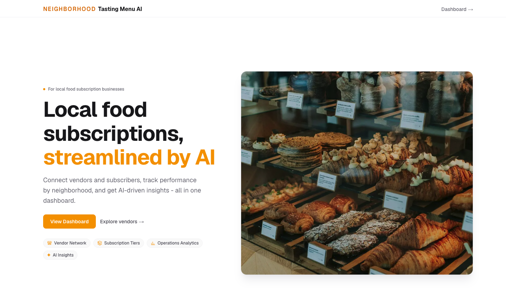
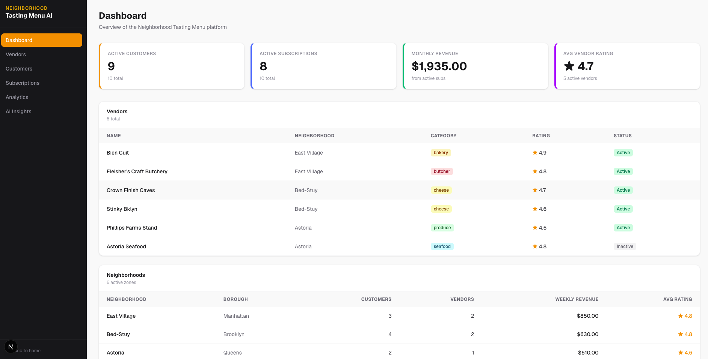
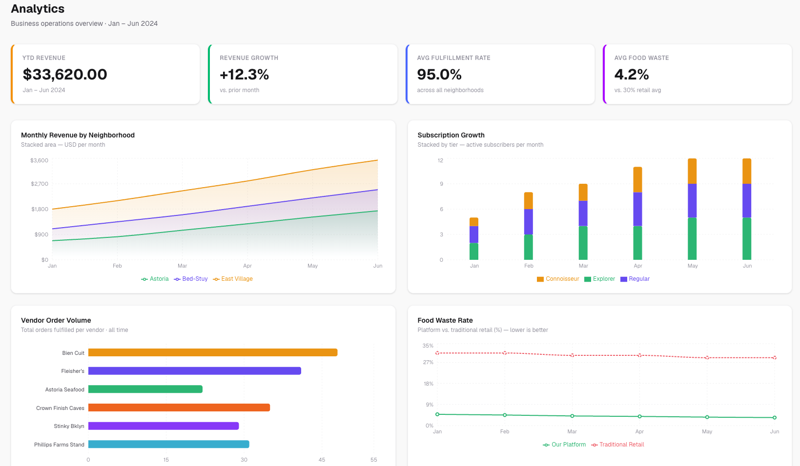
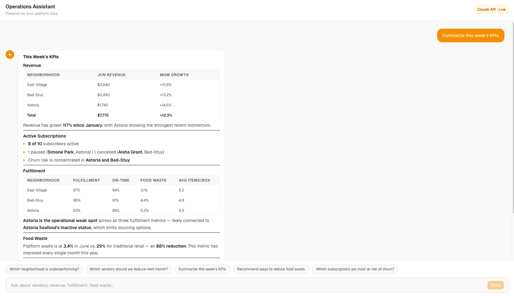

# Saffron *(Working Title)*

## Live Demo

🌐 https://neighborhood-menu-ai.vercel.app

**An AI-powered operations platform for hyper-local food subscription businesses.**

Neighborhood Tasting Menu AI is a full-stack operations dashboard for an NYC subscription box service that curates weekly boxes from local bakeries, butchers, cheesemongers, and farms. Built to explore AI-assisted operations for local food marketplaces.

---

## Problem Statement

Small, hyper-local subscription businesses — a neighborhood bakery box, a farm-share, a cheese-of-the-month club — typically run their operations out of spreadsheets, email, and gut feel. They're too small for enterprise commerce platforms and underserved by generic e-commerce tooling, which isn't built around the things that actually matter to this kind of business: which vendors are underperforming, which subscribers are at risk of churning, how retention and revenue trend by neighborhood, and how to reduce food waste. Answering those questions usually means manually cross-referencing several spreadsheets — if anyone has time to do it at all.

## Solution Overview

Neighborhood Tasting Menu AI centralizes the data a local subscription business actually needs to operate: vendors, customers, subscriptions, and neighborhood-level performance, all in one dashboard. Layered on top is an AI Operations Assistant, powered by Anthropic's Claude API, that answers plain-English business questions ("Which subscriptions are most at risk of churn?") using the same live data driving the rest of the UI — turning a question that would normally take a manual spreadsheet lookup into an instant, actionable answer.

## Key Features

- **Dashboard** — top-line KPIs (active customers, active subscriptions, monthly revenue, average vendor rating) plus vendor and neighborhood performance tables at a glance.
- **Vendors** — browse and filter the vendor network by neighborhood, category, and active status.
- **Customers** — customer directory with neighborhood, subscription tier, and status filtering.
- **Subscriptions** — plan breakdown, MRR trend chart, active/paused/cancelled tracking, churn & retention summary, and computed renewal dates.
- **Analytics** — revenue by neighborhood, subscription growth, vendor order volume, and food-waste-vs-retail charts, plus a fulfillment metrics table.
- **AI Operations Assistant** — a chat interface for asking natural-language questions about the business, with suggested prompts, markdown-formatted responses (including tables), and clear loading/error states.
- **Responsive, polished UI** — collapsible mobile navigation, consistent empty states, and a marketing landing page separate from the app shell.

## Tech Stack

| Layer | Technology |
|---|---|
| Framework | [Next.js 16](https://nextjs.org) (App Router, Turbopack, Server Components) |
| Language | TypeScript |
| UI | React 19, Tailwind CSS v4 |
| Charts | [Recharts](https://recharts.org) |
| AI | [Anthropic Claude API](https://www.anthropic.com) via `@anthropic-ai/sdk` |
| Markdown rendering | `react-markdown` + `remark-gfm` (GitHub-flavored markdown, incl. tables) |
| Tooling | ESLint, npm |
| Deployment | Vercel

There is no database in this version — all business data (vendors, customers, subscriptions, neighborhoods, analytics) lives in a typed mock data layer (see [Architecture](#architecture-overview)) so the project can be cloned and run with zero external services required, aside from an optional Anthropic API key for the AI assistant.

## AI Assistant Explanation

The AI Operations Assistant (`/ai`) is a real integration with Anthropic's Claude API, not a canned demo:

1. The client (`OperationsAssistant` component) sends the user's question to a server-side API route (`/api/ai-insights`) — the Anthropic API key never reaches the browser.
2. The route builds a system prompt **dynamically from the app's own mock data** (neighborhoods, vendors, subscriptions, revenue, fulfillment metrics) each time the module loads, so the assistant's answers always stay consistent with what's rendered elsewhere in the dashboard — there's no separate, hand-maintained copy of the data for the AI to go stale against.
3. Claude is instructed to respond in clean Markdown (headers, bold, lists, and tables where appropriate), which the client renders with `react-markdown` styled to match the rest of the app's design system.
4. The route distinguishes and surfaces specific failure modes to the user — missing/invalid API key, rate limiting, and generic request failures — rather than a single generic error, and the UI shows distinct loading, success, and error states.

If no `ANTHROPIC_API_KEY` is configured, the rest of the app still runs normally; the AI Assistant page simply returns a clear "not configured" message instead of failing.

## Architecture Overview

```
src/
├── app/
│   ├── page.tsx                # Public marketing landing page (outside the app shell)
│   ├── (app)/                  # Route group for the authenticated-feeling dashboard shell
│   │   ├── layout.tsx          #   Shared sidebar/navigation layout
│   │   ├── dashboard/
│   │   ├── vendors/
│   │   ├── customers/
│   │   ├── subscriptions/
│   │   ├── analytics/
│   │   └── ai/
│   └── api/
│       └── ai-insights/route.ts  # Server-only route that calls the Anthropic API
├── components/
│   ├── ai/            # Chat UI for the AI Operations Assistant
│   ├── vendors/ customers/ subscriptions/ analytics/   # Domain-specific views, grouped by feature
│   ├── layout/         # Sidebar / navigation
│   └── ui/             # Shared primitives (KPICard, Badge, EmptyState)
├── data/mock/           # Single source of truth for all business data
├── lib/                 # Formatting helpers + Claude/Supabase client scaffolding
└── types/                # Shared TypeScript types
```

**Notable decisions:**
- The **mock data layer** (`src/data/mock`) is the single source of truth consumed by both the UI *and* the AI assistant's system prompt — this keeps the "product" internally consistent without a real database.
- The **API route pattern** keeps the Anthropic API key server-side only; nothing sensitive is ever shipped to the client bundle.
- The landing page lives outside the `(app)` route group so it can have its own layout (no sidebar) while every dashboard page shares one consistent navigation shell.

## Screenshots

### Landing Page


### Dashboard


### Analytics


### AI Operations Assistant


## Local Setup

**Prerequisites:** Node.js 20+ and npm.

```bash
# 1. Clone the repository
git clone https://github.com/JinoDev/neighborhood-menu-ai.git
cd neighborhood-menu-ai

# 2. Install dependencies
npm install

# 3. Configure environment variables (see below)
cp .env.example .env.local

# 4. Run the dev server
npm run dev
```

Open [http://localhost:3000](http://localhost:3000) to view the app. The dashboard and all pages except the AI Assistant work fully out of the box, with no environment variables required.

## Environment Variables

The AI Operations Assistant requires an Anthropic API key. Everything else in the app works without any configuration.

1. Copy the example file:
   ```bash
   cp .env.example .env.local
   ```
2. Get an API key from the [Anthropic Console](https://console.anthropic.com/) and add it to `.env.local`:
   ```bash
   ANTHROPIC_API_KEY=your_api_key_here
   ```
3. Restart the dev server so it picks up the new environment variable.

`.env.local` is gitignored and never committed — no key is included anywhere in this repository.

| Variable | Required | Description |
|---|---|---|
| `ANTHROPIC_API_KEY` | Optional | Enables the AI Operations Assistant (`/ai`). Without it, the rest of the app runs normally and the assistant returns a clear "not configured" message. |

## Future Improvements

- **Real vendor/customer CRUD** — create, edit, and deactivate vendors, customers, and subscriptions instead of read-only mock data.
- **Streaming AI responses** — stream the Claude response token-by-token instead of waiting for the full reply.
- **Testing** — unit tests for data/formatting utilities and integration tests for the API route.
- **CI/CD** — automated lint/typecheck/build pipeline and a live deployment (e.g., Vercel).
- **Role-based access** — separate views/permissions for operations staff vs. vendors vs. admins.
- **Real screenshots and a demo video** in place of the placeholders above.
- **Persistence** — replace the mock data layer with a real database (Supabase client scaffolding already exists in `src/lib/supabase.ts`) and wire up authentication.

---

Built to demonstrate modern full-stack product development with AI-powered business workflows. 
